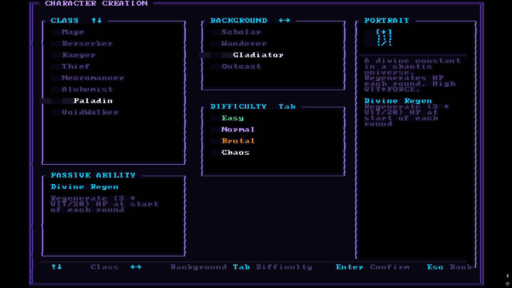
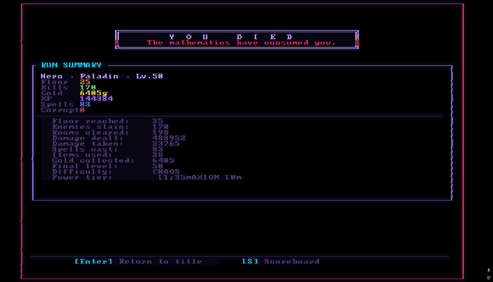
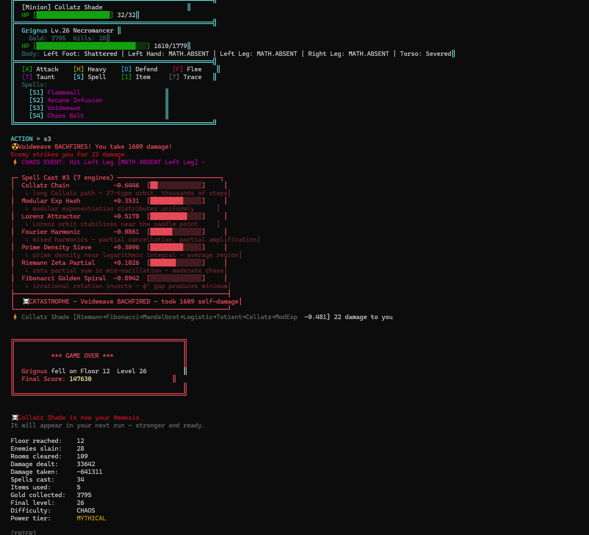
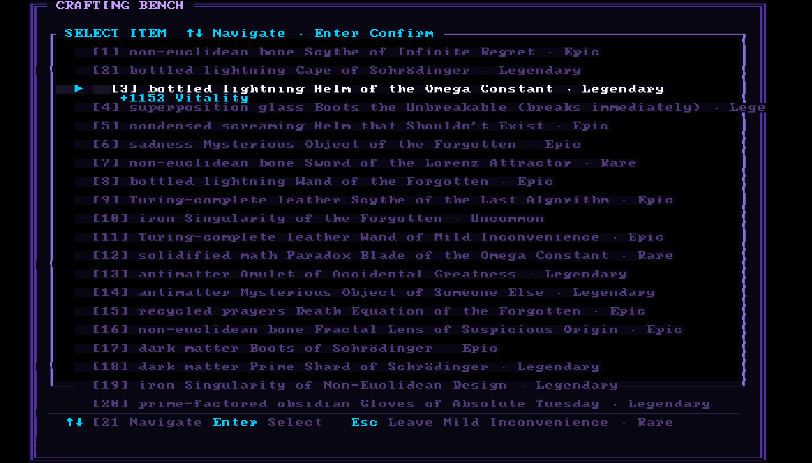
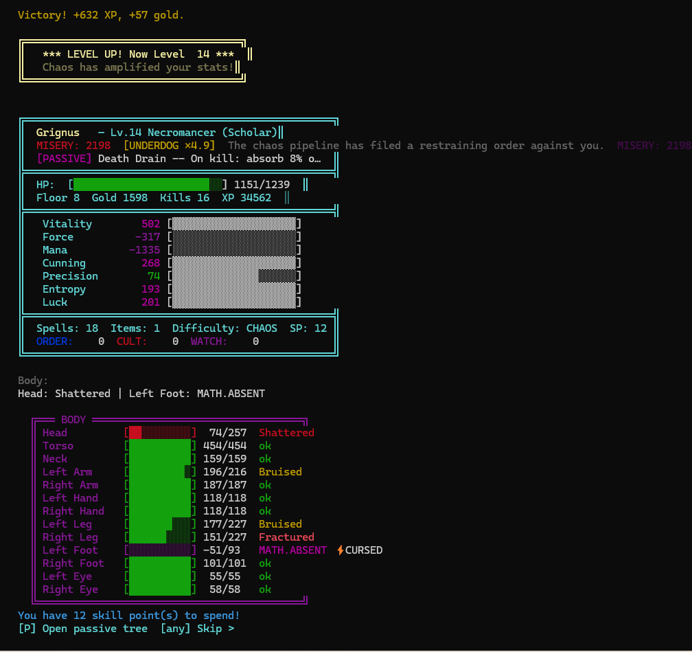
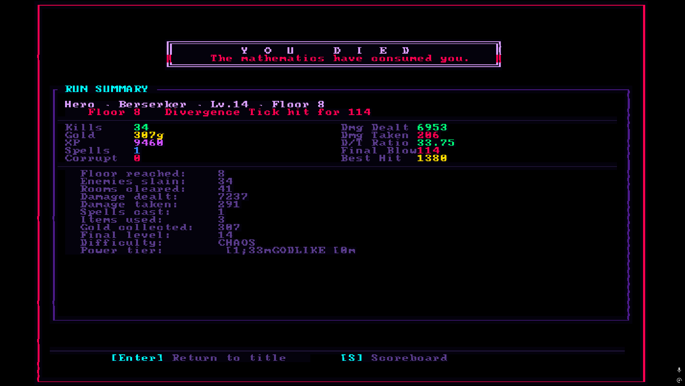
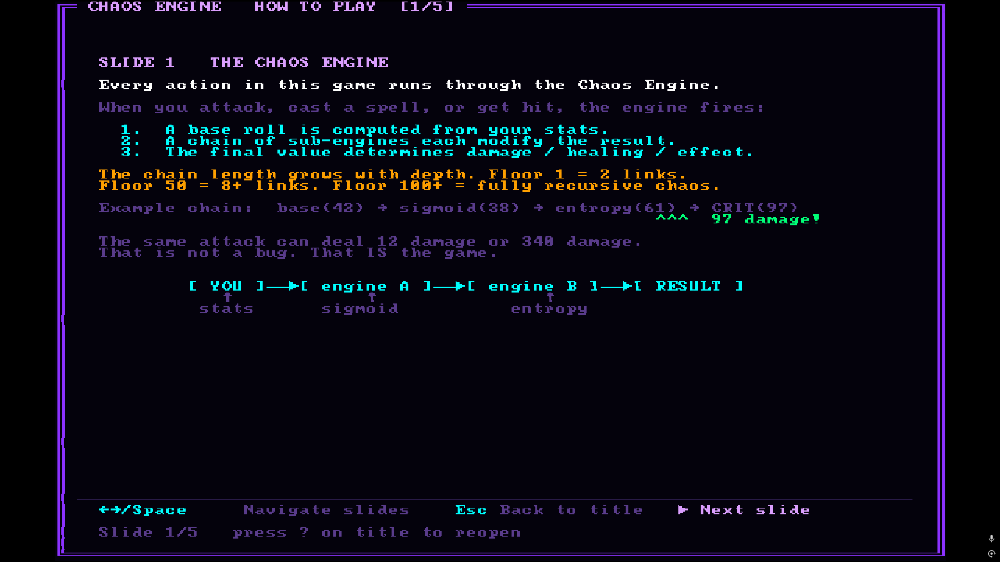

# CHAOS RPG

> *Where Math Goes To Die*

[](https://github.com/Mattbusel/chaos-rpg/actions/workflows/ci.yml)
[](https://github.com/Mattbusel/chaos-rpg/actions/workflows/release.yml)

A roguelike where **every outcome** is produced by chaining real mathematical algorithms together. Character stats, enemy behavior, damage, healing, loot, skill checks, world generation — all of it flows through the same chaos pipeline. The same class can produce wildly different characters on every run. You can roll a deity or a corpse. Both are mathematically valid.

---

## Screenshots

<table>
<tr>
<td><br/><sub>8 classes · 4 backgrounds · 4 difficulties</sub></td>
<td><br/><sub>The Chaos Engine — 8 linked math functions, live chain output</sub></td>
</tr>
<tr>
<td><br/><sub>13-part body system — injuries cascade into MATH.ABSENT</sub></td>
<td><br/><sub>Crafting bench — Reforge, Augment, Corrupt, Mirror and more</sub></td>
</tr>
<tr>
<td><br/><sub>Built-in 5-slide tutorial — press ? on the title screen</sub></td>
<td><br/><sub>Hall of Chaos + Hall of Misery — two separate leaderboards</sub></td>
</tr>
<tr>
<td colspan="2"><br/><sub>Full run summary on death — damage dealt, best hit, D/T ratio, power tier</sub></td>
</tr>
</table>

---

## Download (No Rust Required)

Pre-built binaries are attached to every [GitHub Release](https://github.com/Mattbusel/chaos-rpg/releases).

| Frontend | Platform | Binary |
|----------|----------|--------|
| **Terminal** (ratatui TUI) | Windows | `chaos-rpg-terminal-windows.exe` |
| **Terminal** (ratatui TUI) | Linux | `chaos-rpg-terminal-linux` |
| **Terminal** (ratatui TUI) | macOS | `chaos-rpg-terminal-macos` |
| **Graphical** (OpenGL) | Windows | `chaos-rpg-graphical-windows.exe` |
| **Graphical** (OpenGL) | Linux | `chaos-rpg-graphical-linux` |
| **Graphical** (OpenGL) | macOS | `chaos-rpg-graphical-macos` |

> **Windows:** Double-click the .exe. Use [Windows Terminal](https://aka.ms/terminal) for best color in the TUI version.
> **macOS:** `xattr -d com.apple.quarantine ./chaos-rpg-terminal-macos` if blocked.
> **Linux:** `chmod +x chaos-rpg-terminal-linux && ./chaos-rpg-terminal-linux`

---

## Build from Source

Requires Rust 1.75+ from [rustup.rs](https://rustup.rs).

```bash
git clone https://github.com/Mattbusel/chaos-rpg
cd chaos-rpg

cargo run --release -p chaos-rpg            # terminal frontend
cargo run --release -p chaos-rpg-graphical  # graphical frontend
cargo build --release --workspace           # build everything
```

**Seeded runs:**
```bash
CHAOS_SEED=666 cargo run --release -p chaos-rpg   # Linux/macOS
$env:CHAOS_SEED=666; cargo run --release -p chaos-rpg  # Windows PowerShell
```
Same seed = same character stats, same enemies, same loot, every time.

---

## The Chaos Pipeline

This is the math running under every number in the game.

```
Input seed (u64)
  │
  ▼ Lorenz Attractor
  │   20 iterations of dx/dt=σ(y-x), dy/dt=x(ρ-z)-y, dz/dt=xy-βz
  │   σ=10, ρ=28, β=8/3  → output: x-coordinate
  │
  ▼ Mandelbrot Escape
  │   c = lorenz_x/30 + seed_frac·i
  │   Run z→z²+c up to 100 iterations → normalized escape depth
  │
  ▼ Bifurcation / Logistic Map
  │   r·x·(1-x) iterated from Mandelbrot output
  │
  ▼ Zeta Sum
  │   Partial ζ(s) at s=2+mandelbrot_output → correction factor
  │
  ▼ Collatz Depth
  │   Steps to 1 from seed-derived integer → distribution shaping
  │
  ▼ Fibonacci Normalizer
  │   F(n)/F(n+1) → center around 0
  │
  └─ ChaosRollResult
       .final_value   (typically -100..100, not capped)
       .is_critical() (|value| > 85)
       .is_catastrophe() (value < -95)
       .engine_id     (which engine dominated)
       .trace         (full per-stage output visible in TUI)
```

Every attack, heal, flee attempt, loot roll, enemy stat, and world event uses this pipeline with different seeds and biases. The same damage formula can produce anything from 0 to several thousand depending on what the math decides to do.

**Ten Engines:** The pipeline selects one of 10 mathematical engines per roll: Linear, Lorenz, Zeta, Collatz, Mandelbrot, Fibonacci, Euler, SharpEdge, Orbit, Recursive. Each has different distribution properties (SharpEdge is extreme bimodal; Fibonacci is stable and convergent; Zeta has heavy tails). **EngineLock** crafting can lock an item to always use a specific engine.

**Corruption:** Each kill adds 1 corruption stack. Every 50 stacks, the pipeline's core parameters shift permanently — σ drifts, Zeta's evaluation point moves. By stack 400+, you are running a completely different mathematical system than the one you started with.

---

## Two Frontends, One Game

Both frontends share the same core library (`chaos-rpg-core`). All game logic, saves, and scoreboards are identical.

### Terminal (ratatui)
- Runs in any terminal emulator (80×24 minimum)
- Multi-panel TUI with real-time chaos engine trace panel during combat
- Full color, keyboard driven
- Works over SSH

### Graphical (bracket-lib OpenGL)
- Fullscreen OpenGL window at 80×50 tiles (12×12px each)
- Animated HP/MP gradient bars, double-line panel borders, pulsing status effects
- Five visual themes, selectable with **`[T]`** on the title screen

| Theme | Vibe |
|-------|------|
| **VOID PROTOCOL** | Deep space violet/indigo, electric blue |
| **BLOOD PACT** | Gothic crimson on near-black, ember accents |
| **EMERALD ENGINE** | Matrix green circuit geometry |
| **SOLAR FORGE** | Amber/gold alchemical heat |
| **GLACIAL ABYSS** | Crystalline ice blue, zero-precision cold |

---

## Game Systems

### Game Modes

| Mode | Description |
|------|-------------|
| **Story** | 10 floors, structured narrative, final boss. Recommended for new players. |
| **Infinite** | Floors never end. Score goes on the leaderboard. Enemies scale exponentially. |
| **Daily Seed** | Same dungeon for everyone today. Resets at UTC midnight. |

### Character Creation

Pick a **class**, **background**, and **difficulty**. Stats are rolled by chaining a Destiny Roll → Lorenz attractor → full chaos pipeline. Same class, different character every time.

**12 Classes:**

| Class | Passive Ability |
|-------|----------------|
| **Mage** | Critical spells deal ENTROPY/10 bonus damage |
| **Berserker** | Below 30% HP: +40% damage, attack twice on crit |
| **Ranger** | PRECISION/20 bonus accuracy every attack |
| **Thief** | CUNNING/200 + 10% dodge on incoming hits |
| **Necromancer** | On kill: absorb 8% of enemy max HP |
| **Alchemist** | Items and potions grant 50% more effect |
| **Paladin** | Regenerate (3 + VIT/20) HP at turn start |
| **VoidWalker** | ENTROPY% chance to phase through any attack |
| **Warlord** | Commands soldiers; morale affects damage |
| **Trickster** | Illusion attacks; confusion skills |
| **Runesmith** | Inscribes weapons mid-combat for effects |
| **Chronomancer** | Manipulates action order; time-dilation spells |

**Backgrounds:** Scholar (+mana/cunning), Wanderer (balanced), Gladiator (+force/vitality), Outcast (+entropy/luck)

**Difficulties:** Normal → Hard → Chaos (exponential enemy scaling)

Stats can be **negative**. A character with -40 force genuinely fights at a disadvantage — but the Misery System (below) compensates.

### The Boon System

After character creation, choose one of three randomly offered permanent bonuses. These range from stat boosts to starting items to passive abilities. Only one per run.

### Combat

**Round structure:**
1. Player chooses action
2. Player action resolves (damage = force × chaos_roll / 50)
3. Enemy counterattacks (if alive)
4. Status effects tick (burn, freeze, stun, bleed, poison)
5. Class passive fires

**Actions:**

| Key | Action |
|-----|--------|
| `A` | Attack — basic melee, scales with force |
| `H` | Heavy Attack — more damage, lower accuracy |
| `D` | Defend — reduce incoming damage this round |
| `T` | Taunt — force enemy to attack you (some boss interactions require this) |
| `F` | Flee — luck+cunning roll to escape |
| `1–8` | Cast spell — costs mana, chaos-powered |
| `Q–O` | Use item from inventory |

### Power Tiers

The sum of all 7 stats determines your Power Tier, displayed next to your name. 40 tiers from THE VOID to ΩMEGA. ΩMEGA-tier characters render with animated rainbow text. Negative-tier characters have glitch, static, and inversion effects on their display.

### The Misery System

Suffering accumulates into the Misery Index. The worse things go, the more powerful the compensations become.

**Misery milestones:**
- **5,000**: Spite resource unlocks. Enemies randomly miss you (up to 25%).
- **10,000**: Defiance activates. Near-death amplifies power.
- **25,000**: Cosmic Joke. The game acknowledges what's happening.
- **50,000**: Transcendent Misery. Suffering becomes direct power.
- **100,000**: Published Failure. Immortalized in the Hall of Misery.

**Underdog Multiplier:** Negative total stats give a logarithmic XP and score bonus. A character at -200 total stats earns roughly ×2.3 XP per kill.

**Spite Actions:** Spend Spite points on revenge abilities — Spite Strike (+50% damage), Bitter Endurance (absorb one hit), Chaos Spite (invert an enemy roll).

### The Passive Skill Tree

~820 nodes organized as 8 class-specific rings × 5 levels, connected by bridge clusters. Earn passive points from leveling up and defeating bosses. Start adjacent to your class entry node and traverse outward. Keystones at the tree's deep nodes provide game-changing abilities.

### The Nemesis System

If you flee from an enemy or barely survive a fight, that enemy may be promoted to Nemesis:
- Gains 50–200% HP bonus
- Gains +25% damage
- Gains a unique ability based on the encounter (fire kills → Immolation, spell kills → Spell Reflection)
- Returns on a later floor titled "Slayer of [your name]"
- Killing a Nemesis gives 3× XP, 3× gold, and a Legacy achievement

### The 12 Unique Bosses

Each boss targets a specific build archetype:

| Boss | Floor | Counter |
|------|-------|---------|
| **The Mirror** | 5+ | Copies your exact stats — exploit your class passive |
| **The Accountant** | 10+ | Sends you a bill based on lifetime damage dealt — defend repeatedly |
| **The Fibonacci Hydra** | 15+ | Splits on death following Fibonacci sequence — burst damage or survive 10 splits |
| **The Eigenstate** | 15+ | Superposition of 1 HP (instant kill) or 10,000 HP (no attack) — Taunt to reveal |
| **The Taxman** | 20+ | Taxes your gold every round at escalating rates — kill it fast |
| **The Null** | 25+ | Nullifies the chaos pipeline — base stats only, status effects still work |
| **The Ouroboros** | 30+ | Heals from damage, remembers attack patterns — vary your attacks |
| **The Collatz Titan** | 35+ | HP follows Collatz sequence — force it into powers of 2 |
| **The Committee** | 40+ | 5 members vote on whether your attack resolves — majority rules |
| **The Recursion** | 50+ | Deals damage equal to all damage dealt this fight — burst or die |
| **The Paradox** | 75+ | Inverts defense stats — high Vitality becomes a liability |
| **The Algorithm Reborn** | 100 | The dungeon itself, fully aware — adapts to your playstyle across 3 phases |

Full boss strategies: [docs/BOSSES.md](docs/BOSSES.md)

### Crafting

At Crafting Bench rooms, six operations are available:

| Operation | Effect |
|-----------|--------|
| **Reforge** | Chaos-reroll all stat modifiers from scratch |
| **Augment** | Add one new chaos-rolled modifier |
| **Annul** | Remove one random modifier |
| **Corrupt** | Unpredictable effect — can double values, flip them, add sockets, change item type |
| **Fuse** | Double all values and upgrade rarity tier |
| **EngineLock** | Lock a chaos engine into the item (costs gold, scales with floor) |

### Factions and World Map

The world spans multiple regions under faction control. Reputation with factions affects shop prices, NPC dialogue, enemy hostility, and available quests.

### Party System

Recruit NPCs as party members. Each has their own class, stats, and morale. Morale affects combat performance — lead poorly and they flee.

### Audio

All sound is synthesized procedurally at startup — no audio files. Every SFX (attacks, spells, level-ups, death) and music loop (menu, exploration, combat, boss, cursed floor) is built from oscillators, ADSR envelopes, and filters seeded from the current floor. Audio degrades gracefully — if no audio device is found, the game runs silently.

### Saving, Scoring, and Legacy

**Per-run save:** Auto-saves between floors to `~/.chaos_rpg/save.json`

**Scoreboard:** Top 20 runs saved to `~/.chaos_rpg/scores.json`
```
score = kills × floor × difficulty_multiplier × chaos_bonus × underdog_multiplier
```

**Hall of Misery:** Separate leaderboard for `misery_index × floor × underdog_mult`

**Legacy system (`~/.chaos_rpg/legacy.json`):**
- 34 persistent achievements across all runs
- Character graveyard with procedurally generated epitaphs
- Hall of Misery historical records

---

## Room Types

| Icon | Room | What Happens |
|------|------|-------------|
| `[×]` | Combat | Enemy encounter. No free escape. |
| `[★]` | Treasure | Free item — sometimes cursed. |
| `[$]` | Shop | Buy items, spells, healing with gold. |
| `[~]` | Shrine | Stat bonuses or healing. |
| `[!]` | Trap | Unavoidable damage or debuff. |
| `[B]` | Boss | Unique boss encounter. |
| `[^]` | Portal | Skip to a later floor. Risk vs reward. |
| `[∞]` | Chaos Rift | Pure chaos event. Anything can happen. |
| `[⚒]` | Crafting | Modify items at the bench. |

---

## Project Structure

```
chaos-rpg/
├── core/                      # chaos-rpg-core — all game logic (library crate)
│   └── src/
│       ├── character.rs           stat rolling, leveling, class passives
│       ├── combat.rs              round resolution, action dispatch
│       ├── chaos_pipeline.rs      Lorenz → Mandelbrot → Bifurcation chain
│       ├── enemy.rs               enemy generation, floor scaling, floor abilities
│       ├── bosses.rs              12 unique bosses with custom mechanics
│       ├── items.rs               item system, rarities, stat modifiers
│       ├── spells.rs              spell library, mana costs, damage formulas
│       ├── power_tier.rs          40-tier power table with animated render effects
│       ├── misery_system.rs       Misery Index, Spite, Defiance, Cosmic Joke
│       ├── run_stats.rs           per-run statistics tracker and report card
│       ├── legacy_system.rs       achievements, graveyard, Hall of Misery
│       ├── passive_tree.rs        ~820-node passive skill tree
│       ├── scoreboard.rs          score serialization, leaderboard logic
│       ├── world.rs               floor generation, room type distribution
│       ├── npcs.rs                shop NPC, faction agents
│       ├── nemesis.rs             nemesis promotion, persistence
│       ├── skill_checks.rs        chaos-based skill resolution
│       ├── magic_system.rs        extended magic subsystem
│       └── relationship_system.rs faction reputation, party morale
│
├── terminal/                  # chaos-rpg — terminal frontend (ratatui TUI)
│   └── src/
│       ├── main.rs                game loop, input, state machine
│       ├── ui.rs                  panel rendering, color helpers
│       └── ratatui_screens.rs     per-screen draw functions
│
├── graphical/                 # chaos-rpg-graphical — OpenGL frontend (bracket-lib)
│   └── src/
│       ├── main.rs                game loop, all screen draw functions
│       ├── renderer.rs            box drawing, bars, stat lines, minimap
│       ├── theme.rs               5 color themes with lerp helpers
│       ├── sprites.rs             ASCII art sprite library
│       └── ui_overlay.rs          tooltip and banner helpers
│
├── audio/                     # chaos-rpg-audio — procedural audio (rodio)
│   └── src/
│       ├── lib.rs                 AudioSystem, event dispatch
│       ├── synth.rs               oscillators, ADSR, filters
│       └── events.rs              AudioEvent enum
│
└── docs/
    ├── GETTING_STARTED.md     New player guide
    ├── MECHANICS.md           Deep mechanics reference
    └── BOSSES.md              All 12 bosses documented
```

---

## Contributing

Issues and pull requests welcome. For large changes, open an issue first.

The chaos pipeline parameters (Lorenz σ/ρ/β, Mandelbrot max_iter, bifurcation r range) are intentionally tuned — changes there have cascading effects on all game balance. Test thoroughly.

---

## Further Reading

- [docs/GETTING_STARTED.md](docs/GETTING_STARTED.md) — first run walkthrough, stat explanations, survival tips
- [docs/MECHANICS.md](docs/MECHANICS.md) — full mathematical breakdown of every system
- [docs/BOSSES.md](docs/BOSSES.md) — all 12 bosses, their mechanics, and how to beat them
