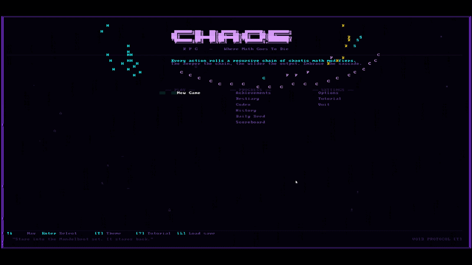
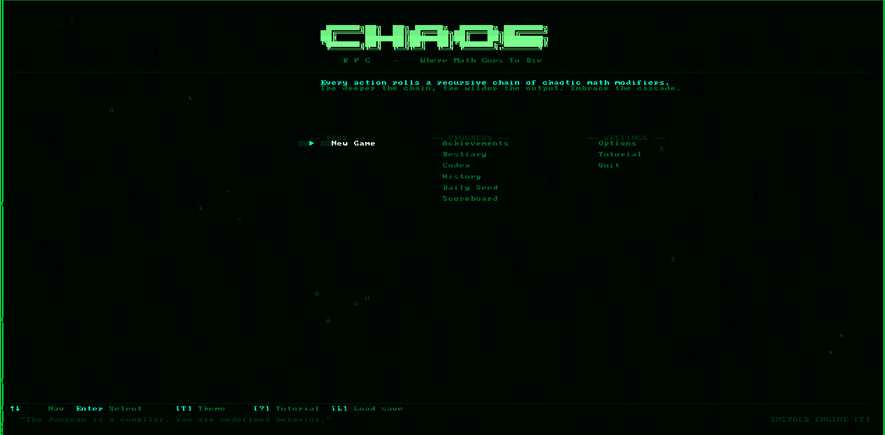
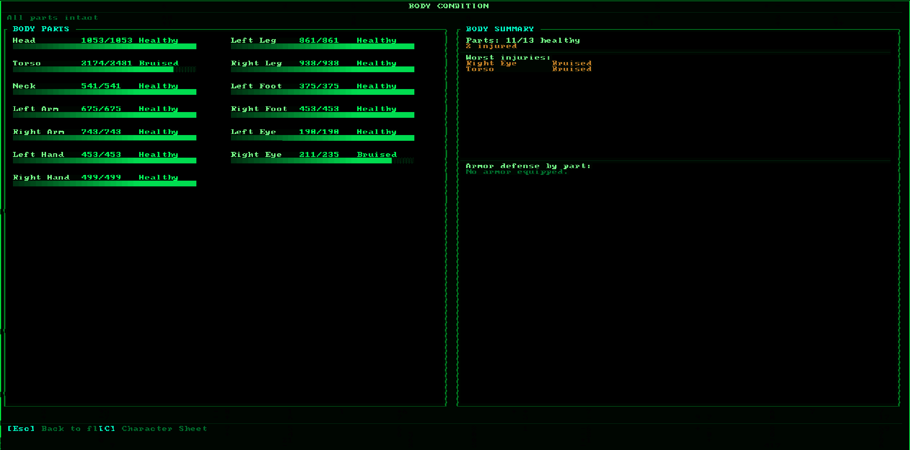
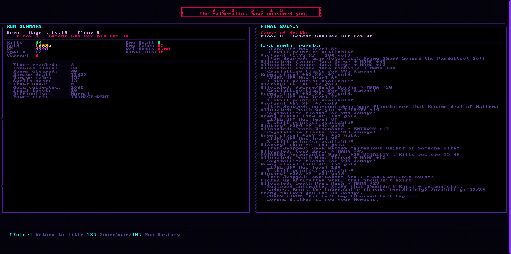

# CHAOS RPG

> *Where Math Goes To Die*

A roguelike where **every outcome** is produced by chaining real mathematical algorithms together. Character stats, enemy behavior, damage, healing, loot, skill checks, world generation - all of it flows through the same chaos pipeline. The same class can produce wildly different characters on every run. You can roll a deity or a corpse. Both are mathematically valid.

---

<p align="center">
  
</p>

---

## Screenshots

<table>
<tr>
<td><br/><sub>Title screen · VOID PROTOCOL theme · grouped Play / Progress / Settings menu</sub></td>
<td><br/><sub>Title screen · EMERALD ENGINE theme · chaos field background</sub></td>
</tr>
<tr>
<td><br/><sub>Character sheet · Stats tab · animated stat bars, run info, faction standings</sub></td>
<td><br/><sub>Body condition · 13-part system · injuries cascade into MATH.ABSENT</sub></td>
</tr>
<tr>
<td colspan="2"><br/><sub>Full run summary on death — dual-panel layout · damage dealt, final events, full combat log</sub></td>
</tr>
</table>

---

## Download and Play

**No installation required. No Rust needed. Just download and run.**

### Option A: GitHub Releases (recommended)

1. Go to the [Releases page](https://github.com/Mattbusel/chaos-rpg/releases)
2. Under the latest release, download:

| File | Description |
|------|-------------|
| `chaos-rpg-graphical.exe` | **Stable release.** Polished bracket-lib OpenGL frontend. Full-featured, battle-tested. **Recommended for playing.** |
| `chaos-rpg-proof.exe` | **Early preview.** Built on a custom 283K-line mathematical rendering engine. Work in progress — rough but functional. |

3. Double-click to run
4. If Windows SmartScreen blocks it: click **More info** then **Run anyway** (full source is public here)

### Option B: itch.io

[mattbusel.itch.io/chaos-rpg](https://mattbusel.itch.io/chaos-rpg)

### Which version should I run?

- **chaos-rpg-graphical** — The stable, polished frontend. Full visual effects, 5 themes, all features. **Play this one.**
- **chaos-rpg-proof** — **Early preview** of the next-generation frontend built on [Proof Engine](https://github.com/Mattbusel/proof-engine), a custom 283K-line mathematical rendering engine. All game mechanics work (combat, bosses, crafting, achievements), but visuals are still being refined. Includes chaos engine visualizer (V key), auto-pilot (Z key), and animated chaos field background. This is a technology preview — expect rough edges.
- **chaos-rpg-graphical** — Legacy bracket-lib frontend. Simpler but stable.
- **chaos-rpg-terminal** — Runs in any terminal. Works over SSH. No GPU required.

---

## Build from Source

Requires Rust 1.75+ from [rustup.rs](https://rustup.rs).

```bash
git clone https://github.com/Mattbusel/chaos-rpg
cd chaos-rpg

cargo run --release -p chaos-rpg-proof      # Proof Engine frontend (recommended)
cargo run --release -p chaos-rpg-graphical  # legacy bracket-lib frontend
cargo run --release -p chaos-rpg-terminal   # terminal frontend
```

**Seeded runs:**
```bash
CHAOS_SEED=666 cargo run --release -p chaos-rpg         # Linux/macOS
$env:CHAOS_SEED=666; cargo run --release -p chaos-rpg   # Windows PowerShell
```
Same seed = same character stats, same enemies, same loot, every time.

---

## The Chaos Pipeline

This is the math running under every number in the game.

```
Input seed (u64)
  │
  ▼ Lorenz Attractor
  │   20 iterations of dx/dt=σ(y-x), dy/dt=x(ρ-z)-y, dz/dt=xy-βz
  │   σ=10, ρ=28, β=8/3  → output: x-coordinate
  │
  ▼ Mandelbrot Escape
  │   c = lorenz_x/30 + seed_frac·i
  │   Run z→z²+c up to 100 iterations → normalized escape depth
  │
  ▼ Bifurcation / Logistic Map
  │   r·x·(1-x) iterated from Mandelbrot output
  │
  ▼ Zeta Sum
  │   Partial ζ(s) at s=2+mandelbrot_output → correction factor
  │
  ▼ Collatz Depth
  │   Steps to 1 from seed-derived integer → distribution shaping
  │
  ▼ Fibonacci Normalizer
  │   F(n)/F(n+1) → center around 0
  │
  └─ ChaosRollResult
       .final_value   (typically -100..100, not capped)
       .is_critical() (|value| > 85)
       .is_catastrophe() (value < -95)
       .engine_id     (which engine dominated)
       .trace         (full per-stage output visible in TUI)
```

Every attack, heal, flee attempt, loot roll, enemy stat, and world event uses this pipeline with different seeds and biases. The same damage formula can produce anything from 0 to several thousand depending on what the math decides to do.

**Ten Engines:** The pipeline selects one of 10 mathematical engines per roll: Linear, Lorenz, Zeta, Collatz, Mandelbrot, Fibonacci, Euler, SharpEdge, Orbit, Recursive. Each has different distribution properties (SharpEdge is extreme bimodal; Fibonacci is stable and convergent; Zeta has heavy tails). **EngineLock** crafting can lock an item to always use a specific engine.

**Corruption:** Each kill adds 1 corruption stack. Every 50 stacks, the pipeline's core parameters shift permanently - σ drifts, Zeta's evaluation point moves. By stack 400+, you are running a completely different mathematical system than the one you started with.

**Chaos Engine Visualizer:** Press **`[V]`** during combat to open a live overlay showing the full engine chain - engine name, raw input, output, delta, and a magnitude bar for each step in the current roll.

---

## Three Frontends, One Game

All frontends share the same core library (`chaos-rpg-core`). 34,800 lines of game logic, zero duplication.

### Proof Engine Frontend (NEW — recommended)

**Powered by [Proof Engine](https://github.com/Mattbusel/proof-engine)** — a custom 221,000+ line mathematical rendering engine built from scratch in Rust. 15,000 lines of frontend code across 54 files.

- **PBR Lighting**: per-room presets (combat red, shrine blue, boss spotlight), per-entity point lights, attack/crit/spell flash lights, status effect lights (burn flicker, freeze steady, poison pulse, stun strobe), floor-depth ambient scaling (warm → cold → void)
- **Shader Graph**: 5 per-theme presets (VOID chromatic+vignette, BLOOD contrast+red, EMERALD CRT+green, SOLAR warm+bloom, GLACIAL desat+blue), floor-depth visual degradation (clean → grain → distortion → VHS), corruption glitch effects, 6 boss-specific shader overrides (Null progressive strip, Paradox hue inversion, Algorithm glitch storm)
- **12 Boss Visuals**: Mirror symmetry line, Accountant gold coins, Fibonacci Hydra golden spiral, Eigenstate form flicker, Taxman gold drain, Null progressive blackout, Ouroboros cycle ring, Collatz live sequence, Committee vote indicators, Recursion stack bar, Paradox reality inversion, Algorithm Reborn 3-phase chaos takeover
- **Cinematics**: 5-phase death sequence, 3-phase victory celebration, 12 unique boss entrance sequences, floor transitions, level-up gold pillar, achievement unlocks (Common→Omega), misery milestones, corruption milestones, nemesis reveal
- **Weather**: digital rain (floors 1-10), compute pulses (11-25), static noise (26-50), ash storms (51-75), electrical storms with lightning (76-99), void snow (100+), boss overrides
- **AI Systems**: 6 steering archetypes, behavior trees (Accountant, Committee), GOAP (Algorithm Reborn), utility AI with logistic scoring
- **Terrain**: isometric noise-based floor map, room-type elevation, epoch-specific glyph sets
- **Economy**: supply/demand pricing, faction treasuries, reputation discounts
- **Dialogue**: Archivist reputation-reactive greetings, boss combat dialogue, Mathematician Fragment codex trees with typewriter and emotion tints
- **Modding**: script hooks (11 event types), mod.toml manifests, hot-reload
- **Replay**: automatic recording, playback with speed control, ghost runs
- **5 Save Slots**: visual state persistence, cloud sync ready
- **Debug Tools**: profiler, field visualizer, inspector, console with 20+ commands

### Legacy Graphical (bracket-lib OpenGL)
- Fullscreen OpenGL window at **160×80 tiles**
- Animated HP/MP bars, 5 color themes, chaos field background
- Included as a fallback for systems without full OpenGL support

### Terminal (ratatui)
- Runs in any terminal emulator (80×24 minimum)
- Full color, keyboard driven, works over SSH

| Theme | Vibe |
|-------|------|
| **VOID PROTOCOL** | Deep space violet/indigo, electric blue |
| **BLOOD PACT** | Gothic crimson on near-black, ember accents |
| **EMERALD ENGINE** | Matrix green circuit geometry |
| **SOLAR FORGE** | Amber/gold alchemical heat |
| **GLACIAL ABYSS** | Crystalline ice blue, zero-precision cold |

---

## Game Systems

### Game Modes

| Mode | Description |
|------|-------------|
| **Story** | 10 floors, structured narrative, final boss. Recommended for new players. |
| **Infinite** | Floors never end. Score goes on the leaderboard. Enemies scale exponentially. |
| **Daily Seed** | Same dungeon for everyone today. Resets at UTC midnight. Score submits to the global leaderboard. |

### Title Screen Keys

| Key | Opens |
|-----|-------|
| `[N]` | New game |
| `[C]` | Continue saved run |
| `[T]` | Cycle color theme |
| `[?]` | Tutorial (5 slides) |
| `[J]` | Achievements (175 total) |
| `[A]` | Achievements browser (terminal) |
| `[H]` | Run history |
| `[D]` | Daily leaderboard |
| `[E]` | Bestiary (graphical) |
| `[X]` | Codex (graphical) |

### Character Creation

Pick a **name**, **class**, **background**, and **difficulty**. Stats are rolled by chaining a Destiny Roll → Lorenz attractor → full chaos pipeline. Same class, different character every time.

In the graphical version: press **`[N]`** on the character creation screen to type your character's name (up to 20 characters). Leave blank to default to "Hero".

**12 Classes:**

| Class | Passive Ability |
|-------|----------------|
| **Mage** | Critical spells deal ENTROPY/10 bonus damage |
| **Berserker** | Below 30% HP: +40% damage, attack twice on crit |
| **Ranger** | PRECISION/20 bonus accuracy every attack |
| **Thief** | CUNNING/200 + 10% dodge on incoming hits |
| **Necromancer** | On kill: absorb 8% of enemy max HP |
| **Alchemist** | Items and potions grant 50% more effect |
| **Paladin** | Regenerate (3 + VIT/20) HP at turn start |
| **VoidWalker** | ENTROPY% chance to phase through any attack |
| **Warlord** | Commands soldiers; morale affects damage |
| **Trickster** | Illusion attacks; confusion skills |
| **Runesmith** | Inscribes weapons mid-combat for effects |
| **Chronomancer** | Manipulates action order; time-dilation spells |

**8 Backgrounds:**

| Background | Starting Bonus |
|------------|---------------|
| **Scholar** | +15 MANA, +10 ENTROPY |
| **Wanderer** | +15 LUCK, +10 PRECISION |
| **Gladiator** | +15 FORCE, +10 VITALITY |
| **Outcast** | +15 CUNNING, +10 ENTROPY |
| **Merchant** | +15 CUNNING, +10 LUCK |
| **Cultist** | +20 MANA, +20 ENTROPY, -10 VITALITY |
| **Exile** | +20 CUNNING, +10 ENTROPY, -10 MANA |
| **Oracle** | +20 LUCK, +10 MANA, -15 FORCE |

**4 Difficulties:** Easy (0.7× enemy damage, score ×1) → Normal (score ×2) → Brutal (1.4×, score ×4) → CHAOS (2×, all random effects maximized, score ×10)

Stats can be **negative**. A character with -40 force genuinely fights at a disadvantage - but the Misery System compensates.

### The Boon System

After character creation, choose one of three randomly offered permanent bonuses. These range from stat boosts to starting items to passive abilities. Only one per run. The graphical selection screen shows full boon details in a right-side panel.

### Combat

**Round structure:**
1. Player chooses action
2. Player action resolves (damage = force × chaos_roll / 50)
3. Enemy counterattacks (if alive)
4. Status effects tick (burn, freeze, stun, bleed, poison)
5. Class passive fires

**Actions:**

| Key | Action |
|-----|--------|
| `A` | Attack - basic melee, scales with force |
| `H` | Heavy Attack - more damage, lower accuracy |
| `D` | Defend - reduce incoming damage this round |
| `T` | Taunt - force enemy to attack you |
| `F` | Flee - luck+cunning roll to escape |
| `1-8` | Cast spell - costs mana, chaos-powered |
| `Q-O` | Use item from inventory |
| `V` | Toggle Chaos Engine Visualizer overlay |

### Auto-Pilot

Press **`[Z]`** on the floor map to activate Auto-Pilot. The AI handles all navigation and combat decisions automatically, pausing at:
- Item pickup prompts
- Shop / Crafting screens
- Game Over / Victory

When active, the floor map shows **"◆ AUTO-PILOT  [Z] to stop"** - press `[Z]` again to resume manual control. The terminal version shows **[AUTO PILOT ON - Z to stop]** in the status line.

### Power Tiers

The sum of all 7 stats determines your Power Tier, displayed next to your name. 40 tiers from THE VOID to OMEGA. OMEGA-tier characters render with animated rainbow text. Negative-tier characters have glitch, static, and inversion effects on their display.

### The Misery System

Suffering accumulates into the Misery Index. The worse things go, the more powerful the compensations become.

**Misery milestones:**
- **5,000**: Spite resource unlocks. Enemies randomly miss you (up to 25%).
- **10,000**: Defiance activates. Near-death amplifies power.
- **25,000**: Cosmic Joke. The game acknowledges what's happening.
- **50,000**: Transcendent Misery. Suffering becomes direct power.
- **100,000**: Published Failure. Immortalized in the Hall of Misery.

**Underdog Multiplier:** Negative total stats give a logarithmic XP and score bonus. A character at -200 total stats earns roughly ×2.3 XP per kill.

**Spite Actions:** Spend Spite points on revenge abilities - Spite Strike (+50% damage), Bitter Endurance (absorb one hit), Chaos Spite (invert an enemy roll).

### The Passive Skill Tree

~820 nodes organized as 8 class-specific rings × 5 levels, connected by bridge clusters. Earn passive points from leveling up and defeating bosses. Start adjacent to your class entry node and traverse outward. Keystones at the tree's deep nodes provide game-changing abilities.

Press **`[P]`** on the character sheet to view the full tree. Press **`[N]`** anywhere to auto-allocate all pending points.

### The Nemesis System

If you flee from an enemy or barely survive a fight, that enemy may be promoted to Nemesis:
- Gains 50–200% HP bonus
- Gains +25% damage
- Gains a unique ability based on the encounter (fire kills → Immolation, spell kills → Spell Reflection)
- Returns on a later floor titled "Slayer of [your name]"
- Killing a Nemesis gives 3× XP, 3× gold, and a Legacy achievement

### The 12 Unique Bosses

Each boss targets a specific build archetype:

| Boss | Floor | Counter |
|------|-------|---------|
| **The Mirror** | 5+ | Copies your exact stats - exploit your class passive |
| **The Accountant** | 10+ | Sends you a bill based on lifetime damage dealt - defend repeatedly |
| **The Fibonacci Hydra** | 15+ | Splits on death following Fibonacci sequence - burst damage or survive 10 splits |
| **The Eigenstate** | 15+ | Superposition of 1 HP (instant kill) or 10,000 HP (no attack) - Taunt to reveal |
| **The Taxman** | 20+ | Taxes your gold every round at escalating rates - kill it fast |
| **The Null** | 25+ | Nullifies the chaos pipeline - base stats only, status effects still work |
| **The Ouroboros** | 30+ | Heals from damage, remembers attack patterns - vary your attacks |
| **The Collatz Titan** | 35+ | HP follows Collatz sequence - force it into powers of 2 |
| **The Committee** | 40+ | 5 members vote on whether your attack resolves - majority rules |
| **The Recursion** | 50+ | Deals damage equal to all damage dealt this fight - burst or die |
| **The Paradox** | 75+ | Inverts defense stats - high Vitality becomes a liability |
| **The Algorithm Reborn** | 100 | The dungeon itself, fully aware - adapts to your playstyle across 3 phases |

Full boss strategies: [docs/BOSSES.md](docs/BOSSES.md)

### Crafting

At Crafting Bench rooms, nine operations are available. The graphical version shows the selected item's current modifiers in a right-side detail panel.

| Key | Operation | Effect |
|-----|-----------|--------|
| `1` | **Reforge** | Chaos-reroll all stat modifiers from scratch |
| `2` | **Augment** | Add one new chaos-rolled modifier |
| `3` | **Annul** | Remove one random modifier |
| `4` | **Corrupt** | Choose risk tier (Safe/Risky/Reckless) - unpredictable chaos effect |
| `5` | **Fuse** | Double all values and upgrade rarity tier |
| `6` | **EngineLock** | Lock a chaos engine into the item permanently |
| `7` | **Shatter** | Destroy the item and scatter its modifiers to other items |
| `8` | **Imbue** | Grant the item 3 charges (bonus effect on use) |
| `9` | **Repair** | Restore item durability to maximum (costs gold) |

**Item Filter:** Press **`/`** in the item selection screen to type-ahead filter by name or rarity. Clear the filter with `Escape`.

### Achievements

175 achievements across 7 rarity tiers, tracked persistently across all runs.

- **Graphical:** Press **`[J]`** on the title screen
- **Terminal:** Press **`[A]`** on the title screen - shows unlocked/locked tabs, rarity colors, progress bars, filter by All/Unlocked/Locked

| Tier | Examples |
|------|---------|
| **Common** | Reach floor 5, deal first kill |
| **Uncommon** | Win on Hard, reach floor 15 |
| **Rare** | Beat a Nemesis, win with negative stats |
| **Epic** | Win on Chaos difficulty, floor 100 |
| **Legendary** | Complete all class masteries |
| **Mythic** | Floor 500, 10,000 total kills |
| **Omega** | Transcendent feats across the entire run history |

Unlocked achievements display full name, description, and unlock date. Locked achievements show `???` until earned.

### Bestiary

Press **`[E]`** on the graphical title screen to open the Bestiary. Every enemy you have encountered is recorded with:
- Times seen, times killed, times it killed you
- Maximum damage dealt
- Lore snippet

The bestiary shows 66 entries at once on the full 160×80 canvas and scrolls with `↑↓`.

### Codex

Press **`[X]`** on the graphical title screen to open the Codex - a lore encyclopedia covering world lore, item descriptions, spell origins, and narrative fragments discovered during runs. Entries unlock as you encounter the corresponding content.

### Run Narrative

After each run, a procedurally generated narrative is recorded in the run history - a short story summarizing the key moments of your run (first kill, near-death moments, nemesis encounters, final fate). Press **`[H]`** on the title screen and select a run to read its full narrative.

### Run History

Press **`[H]`** on the title screen to view a scrollable table of all past runs. The graphical version shows 62 runs at once with extended columns: class, floor, score, kills, mode, difficulty, gold, power tier, and cause of death.

### Daily Leaderboard

Press **`[D]`** on the title screen to view the daily leaderboard. Daily Seed mode uses the same dungeon for all players on a given UTC day. After completing a Daily Seed run, your score is submitted to the global leaderboard automatically.

- Today's seed is shown at the top of the screen
- Your personal best for today is shown below the seed
- The global rankings are listed by rank, name, class, floor, score, and kills
- Press **`[R]`** to refresh the remote scores

### Audio

All sound is synthesized procedurally at startup - no audio files. Every SFX (attacks, spells, level-ups, death) and music loop (menu, exploration, combat, boss, cursed floor) is built from oscillators, ADSR envelopes, and filters seeded from the current floor.

**Music vibes** (set in `chaos_config.toml`):
- `chill` (default) - ambient, low-tempo
- `classic` - heavier, more intense
- `minimal` - sparse, almost silent
- `off` - no music, SFX only

Audio degrades gracefully - if no audio device is found, the game runs silently.

### Saving, Scoring, and Legacy

**Per-run save:** Auto-saves between floors to the same folder as the executable

**Scoreboard:** Top scores saved locally
```
score = kills × floor × difficulty_multiplier × chaos_bonus × underdog_multiplier
```

**Hall of Misery:** Separate leaderboard for `misery_index × floor × underdog_mult`

**Legacy system:**
- 175 persistent achievements across all runs across 7 rarity tiers
- Full run history with per-run statistics and procedural narratives
- Character graveyard with procedurally generated epitaphs
- Hall of Misery historical records

---

## Configuration

`chaos_config.toml` is read from the same folder as the executable on startup. All fields are optional - defaults are used for anything not specified.

```toml
[audio]
# Music vibe: chill (default) | classic | minimal | off
music_vibe = "chill"
# Master music volume (0.0 = silent, 1.0 = default, 2.0 = double)
music_volume = 1.0
# Master SFX volume
sfx_volume = 1.0

[display]
# Multiply particle drift speed (1.0 = default)
particle_speed_mult = 1.0
# Override kill-linger frame count (0 = engine default ~45)
kill_linger_frames = 0
# Halve all visual timings (same as FAST_MODE=1 env var)
fast_mode = false

[gameplay]
# Bonus gold at run start (0 = none)
starting_gold_bonus = 0
# Scale all enemy HP and damage (1.0 = normal, 2.0 = double)
difficulty_modifier = 1.0
# Force a specific seed for Infinite mode (0 = random)
infinite_seed_override = 0
# Disable mechanics
disable_hunger = false
disable_nemesis = false
disable_corruption = false
# Extra inventory slots (0-20)
extra_inventory_slots = 0
# XP multiplier bonus (0.0 = none, 1.0 = double XP)
xp_multiplier = 0.0

[leaderboard]
url = "https://chaos-rpg-leaderboard.mfletcherdev.workers.dev"
submit_daily = true
fetch_on_open = true

[meta]
# Override player name shown in leaderboard submissions
player_name = ""
```

---

## Room Types

| Icon | Room | What Happens |
|------|------|-------------|
| `[x]` | Combat | Enemy encounter. No free escape. |
| `[*]` | Treasure | Free item - sometimes cursed. |
| `[$]` | Shop | Buy items, spells, healing with gold. Graphical version shows your inventory in a right-side panel. |
| `[~]` | Shrine | Stat bonuses or healing. |
| `[!]` | Trap | Unavoidable damage or debuff. |
| `[B]` | Boss | Unique boss encounter. |
| `[^]` | Portal | Skip to a later floor. Risk vs reward. |
| `[8]` | Chaos Rift | Pure chaos event. Anything can happen. |
| `[c]` | Crafting | Modify items at the bench. |

---

## Project Structure

**86,000+ lines of Rust** across 5 crates. Powered by **[Proof Engine](https://github.com/Mattbusel/proof-engine)** (221,000+ lines).

```
chaos-rpg/
├── core/                         # chaos-rpg-core — all game logic (34,800 lines)
│   └── src/
│       ├── character.rs              12 classes, 8 backgrounds, stat rolling, passives
│       ├── combat.rs                 round resolution, chaos-powered damage
│       ├── chaos_pipeline.rs         10-engine mathematical chain
│       ├── bosses.rs                 12 unique bosses with custom mechanics
│       ├── passive_tree.rs           ~820-node skill tree
│       ├── misery_system.rs          Misery Index, Spite, Defiance
│       ├── achievement_system.rs     175 achievements, 7 rarity tiers
│       └── ... (77 source files)
│
├── graphical-proof/              # chaos-rpg-proof — PROOF ENGINE FRONTEND (15,000 lines)
│   └── src/
│       ├── main.rs                   ProofGame impl, game loop, screen dispatch
│       ├── state.rs                  150+ field game state
│       ├── theme.rs                  5 themes with engine shader properties
│       ├── lighting.rs               PBR room/combat/boss/floor lighting
│       ├── shader_presets.rs         theme/floor/corruption/boss/status compositing
│       ├── cinematics.rs             boss entrances, death/victory, milestones
│       ├── enemy_ai.rs               steering, behavior trees, GOAP, utility AI
│       ├── weather_system.rs         10 weather types, floor-reactive
│       ├── terrain_map.rs            isometric noise terrain, room elevation
│       ├── game_economy.rs           supply/demand, faction treasuries
│       ├── dialogue_system.rs        Archivist, boss, NPC, codex dialogues
│       ├── mod_system.rs             mod loader, 11 hooks, hot-reload
│       ├── replay_system.rs          recording, playback, ghost runs
│       ├── save_upgrade.rs           5 slots, visual snapshots, cloud sync
│       ├── effects/boss_visuals.rs   12 unique boss visual overlays
│       ├── scenes/chaos_field.rs     2000+ glyph mathematical background
│       ├── screens/                  19 fully implemented screens
│       └── ... (54 source files)
│
├── graphical/                    # chaos-rpg-graphical — legacy bracket-lib (11,900 lines)
├── terminal/                     # chaos-rpg-terminal — ratatui TUI (6,000 lines)
├── audio/                        # chaos-rpg-audio — procedural synthesis (370 lines)
├── web/                          # web frontend — macroquad (470 lines)
│
├── proof-engine/                 # THE ENGINE — 221,000+ lines, 249 files
│   └── (separate repo: github.com/Mattbusel/proof-engine)
│
├── dist/                         # Release packages
│   └── chaos-rpg-v2.0.0-windows.zip
│
├── server/                       # Cloudflare Worker leaderboard
└── docs/                         # Guides, mechanics, boss docs
```

---

## Contributing

Issues and pull requests welcome. For large changes, open an issue first.

The chaos pipeline parameters (Lorenz σ/ρ/β, Mandelbrot max_iter, bifurcation r range) are intentionally tuned - changes there have cascading effects on all game balance. Test thoroughly.

---

## Further Reading

- [docs/GETTING_STARTED.md](docs/GETTING_STARTED.md) - first run walkthrough, stat explanations, survival tips
- [docs/MECHANICS.md](docs/MECHANICS.md) - full mathematical breakdown of every system
- [docs/BOSSES.md](docs/BOSSES.md) - all 12 bosses, their mechanics, and how to beat them
- [docs/LORE.md](docs/LORE.md) - the full lore of The Proof: epochs, factions, engines, bosses, bestiary, items, Fragments
